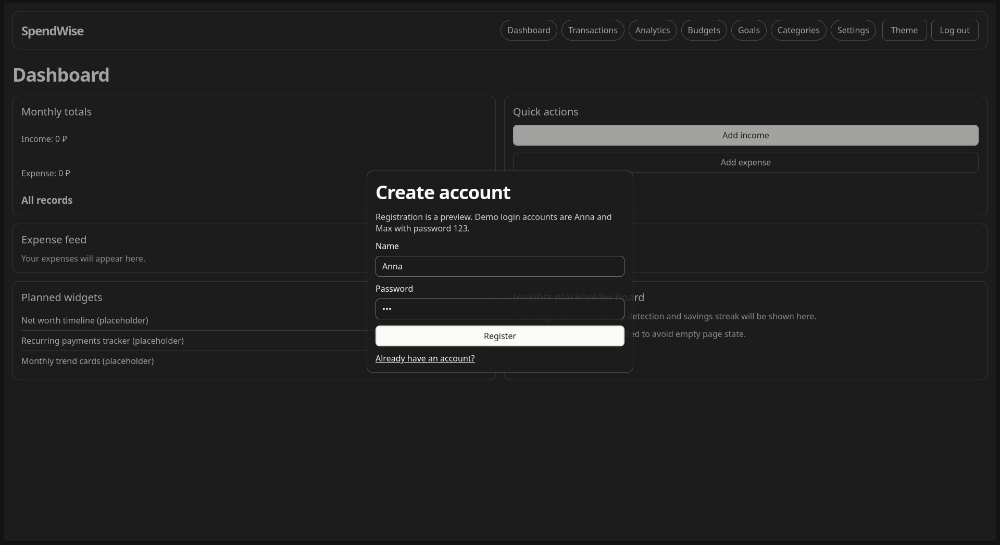
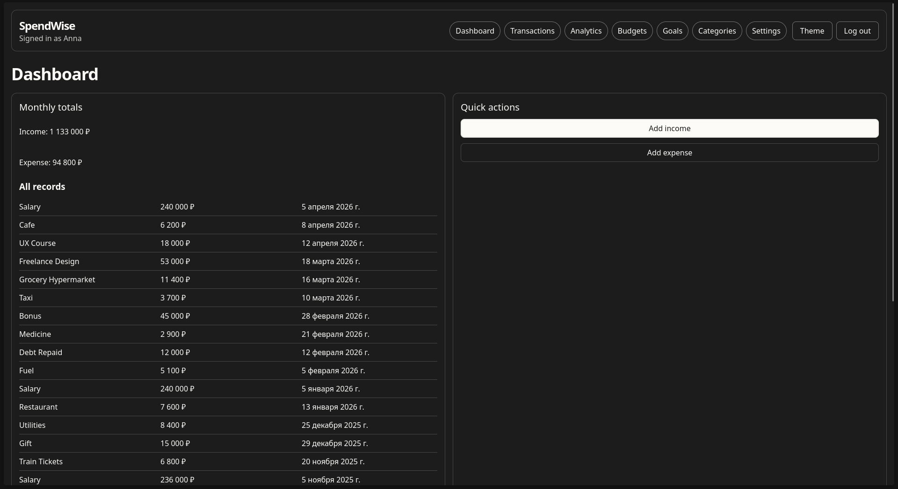
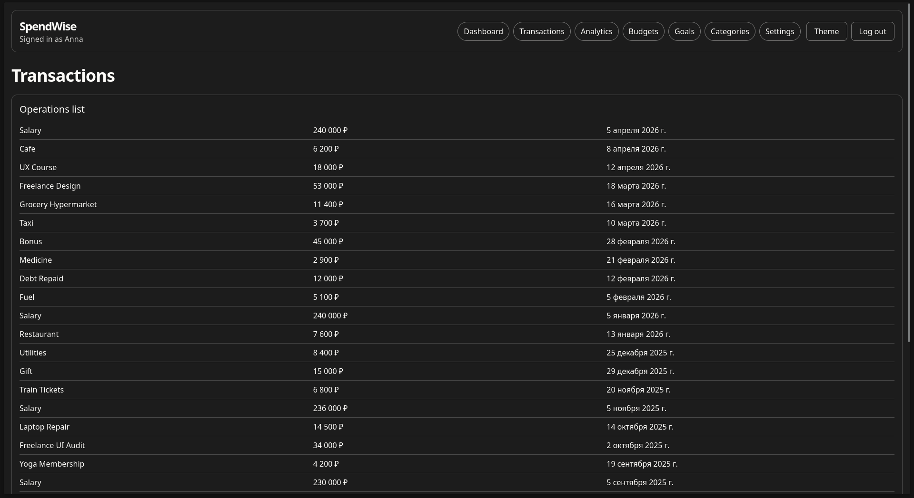
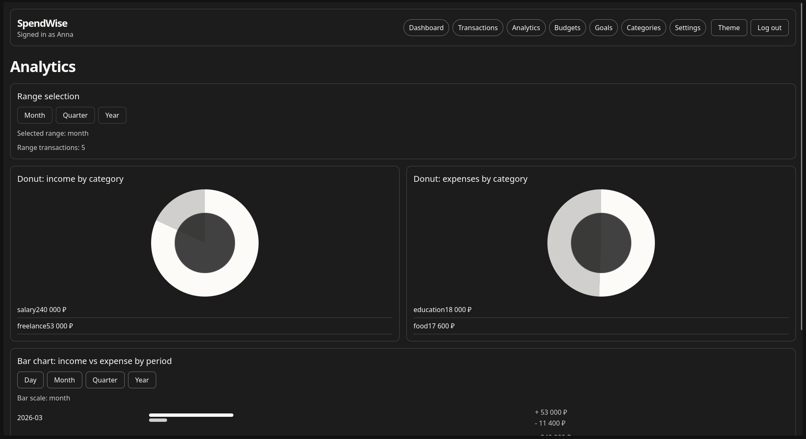
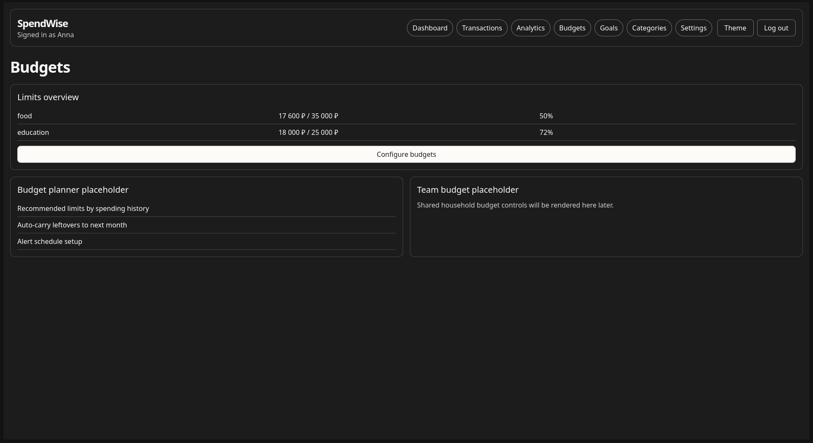
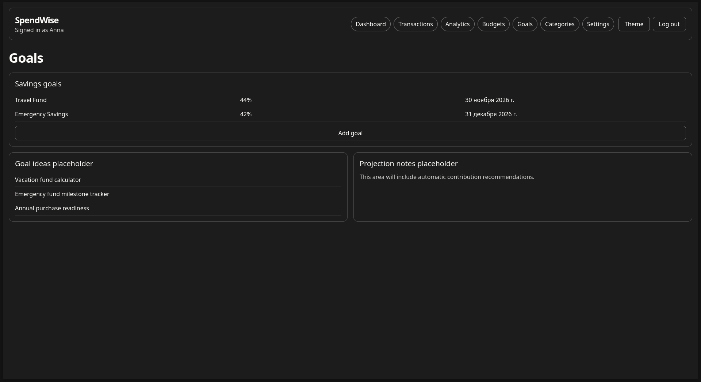
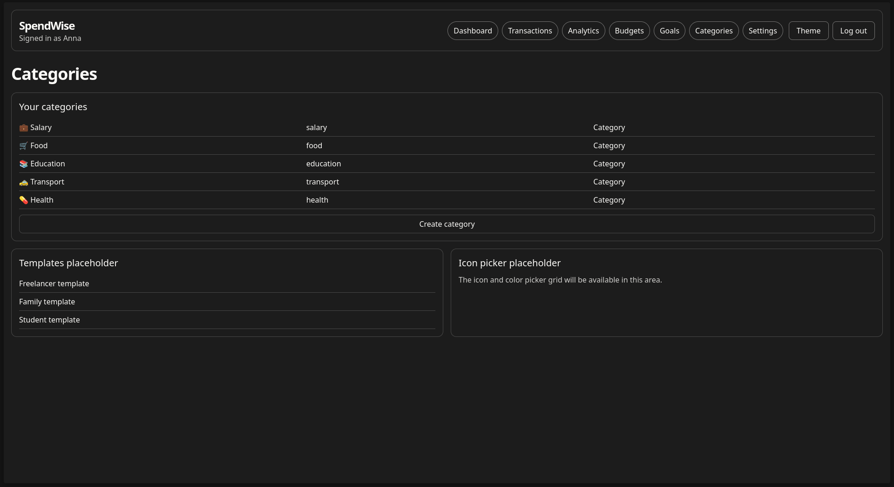
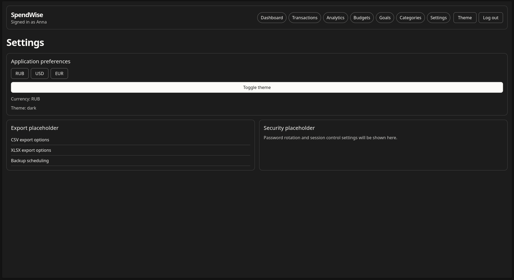

# SpendWise

SpendWise is a personal finance SPA for tracking income, expenses, budgets, goals, and analytics.

## Demo accounts

Use any of the mock accounts below:

- **Anna / 123**
- **Max / 123**

## Tech stack

- Vue 3 + TypeScript (`<script setup>`)
- Pinia (state)
- Vue Router
- Vite
- CSS tokens (`src/assets/styles/tokens.css`)

## Main pages

- Dashboard
- Transactions
- Analytics
- Budgets
- Goals
- Categories
- Settings

## Analytics included

- Donut chart: income by category
- Donut chart: expenses by category
- Bar chart: income vs expense by period
- Cashflow trend
- Savings rate gauge
- Bar scale switch: **day / month / quarter / year**

## Local run

```bash
npm install
npm run dev
```

Optional checks:

```bash
npm run typecheck
npm run lint
npm run test
```

## Screenshots

> Replace the placeholder image files below with your own screenshots.
> You can keep the same paths, and README links will work automatically.

### Navigation links

- [Auth modal](#auth-modal)
- [Dashboard](#dashboard)
- [Transactions](#transactions)
- [Analytics](#analytics)
- [Budgets](#budgets)
- [Goals](#goals)
- [Categories](#categories)
- [Settings](#settings)

### Auth modal



### Dashboard



### Transactions



### Analytics



### Budgets



### Goals



### Categories



### Settings



## Project structure

```text
src/
  assets/styles/
  components/
    common/
    layout/
  composables/
  pages/
  router/
  services/
  stores/
  types/
```

## Notes

- Authentication is mock-only (local demo flow).
- Data is seeded from mock profiles and not persisted to backend.
